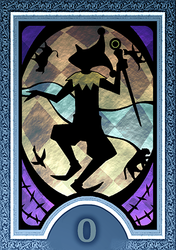

# ABOUT ME

> **SHIA // UNISA STUDENT**  
> *"Benvenuto sul mio canale personale, **The Shia Channel**! Questa pagina è uno showcase delle mie passioni più che dei miei progetti, ma nonostante ciò spero possa graderti. Già che ci sei, se stai leggendo questo messaggio puoi contattarmi tramite i miei **Social Link** ;)"*

Ciao! Mi chiamo **Cristian** (alias online **Shia**) e ho 21 anni. Sono uno studente di Informatica presso l'Università degli Studi di Salerno, e se non si fosse notato, un grande fan di **Persona 4**, il mio gioco Atlus preferito. Ma dunque all'infuori di questo, chi sono davvero? Qual è il **vero io**? <!--Enter sezione dedicata allo spiegare Persona 4 e il pensiero filosofico, in breve.--> 

  <a href="#social-links" class="p4-btn">▶ SOCIAL LINKS</a>
  <a href="#progetti" class="p4-btn p4-btn">📺 PROGETTI</a>
  <a href="#status" class="p4-btn">⚡ SKILLS AND STATS </a>

---

<h2 id="social-links">Social Links (S-Links)</h2>

> **??? // THE TRUE SELF**  
> *"**Thou art I... And I am thou... Thou hast established a new bond... It brings thee closer to the truth...**"*

  <!-- GitHub -->
  <a href="https://github.com/cristian-carotenuto" class="slink-card" target="_blank" rel="noopener">
  

    
  

  

    GitHub
    ARCANA: THE FOOL // CODING
  

</a>

  <!-- LinkedIn -->
  <a href="https://www.linkedin.com/in/cristian-carotenuto-11a57933b" class="slink-card" target="_blank" rel="noopener">
  

    
  

  

    LinkedIn
    ARCANA: THE SUN // CAREER
  

</a>

  <!-- Email -->
  <a href="mailto:ccristian.carotenuto@gmail.com" class="slink-card" target="_blank" rel="noopener">
  

    
  

  

    Email
    ARCANA: THE HIEROPHANT // DIRECT MSG
  

</a>

  <!-- Steam -->
  <a href="https://steamcommunity.com/id/quel_player_random/" class="slink-card" target="_blank" rel="noopener">
  

    
  

  

    Steam
    ARCANA: THE MAGICIAN // GAMING
  

</a>

  <!-- Discord -->
  <a href="https://discordapp.com/users/263351865566035970" class="slink-card" target="_blank" rel="noopener">
  

    
  

  

    Steam
    ARCANA: THE JESTER // GAMING
  

</a>

---

<h2 id="progetti">Tonight's Broadcasts... </h2>

> **MYSTERIOUS TV BROADCAST // THE URBAN LEGEND**  
> *"You're supposed to look into a TV that's switched off, alone, exactly at **midnight** on a **rainy night**. While you're staring at your own image, another person will appear on the screen... And they say that person's your **soulmate**."*

  <!-- TV Project Card 1 -->
  

    

      SVAGO
      ● ON AIR
    

    

      <h3 class="tv-card-title">Persona 4 GitHub Page Theme</h3>
      

        Personalizzazione completa e dinamica di GitHub Page in stile Persona 4. No ma è letteralmente questa pagina che stai vedendo adesso, è un self-insert doveroso dai... <strong>Tecnologie usate : SCSS, HTML.</strong>   
      

    

    

      <a href="https://github.com/cristian-carotenuto/cristian-carotenuto.github.io" class="p4-btn" target="_blank" rel="noopener" style="font-size: 1.1rem; padding: 4px 16px !important;">
        Repository ▶
      </a>
    

  

  <!-- TV Project Card 2 -->
  

    

      UNIVERSITY
      ● ON AIR
    

    

      <h3 class="tv-card-title">MAP4AID</h3>
      

        Map4Aid è una piattaforma web dedicata alla solidarietà e all'assistenza sociale che mira a digitalizzare e semplificare l'accesso ai beni di prima necessità e a facilitare le donazioni sul territorio. <strong>Tecnologie usate: Python, Flask, SQLite, HTML, CSS, JS.</strong>
      

    

    

      <a href="https://github.com/cristian-carotenuto/map4aid" class="p4-btn p4-btn" target="_blank" rel="noopener" style="font-size: 1.1rem; padding: 4px 16px !important;">
        Repository ▶
      </a>
    

  

  <!-- TV Project Card 3 -->
  

    

      UNIVERSITY
      ● ON AIR
    

    

      <h3 class="tv-card-title">AIDANO</h3>
      

        Aidano è un assistente virtuale knowledge-based sviluppato nell'ambito del progetto Map4Aid. Il chatbot è stato progettato per assistere gli utenti della piattaforma fornendo risposte rapide, coerenti e contestualizzate riguardo ai servizi offerti. <strong>Tecnologie usate: Python, QWEN 2.5-3B.</strong>
      

    

    

      <a href="https://github.com/cristian-carotenuto/Aidano" class="p4-btn p4-btn" target="_blank" rel="noopener" style="font-size: 1.1rem; padding: 4px 16px !important;">
        Repository ▶
      </a>
    

  

  
    <!-- TV Project Card 4 -->
  

    

      VOLUNTEERING
      ● ON AIR
    

    

      <h3 class="tv-card-title">RETE CIVES CAMPANIA</h3>
      

      Ho contribuito allo sviluppo della piattaforma della rete CIVES grazie al presidente <strong>Giuseppe Fornaro</strong>. La CIVES è una rete di associazioni del Terzo Settore attiva in Campania per promuovere inclusione sociale, autonomia personale e accessibilità per persone con disabilità, in particolare non vedenti, ipovedenti e le loro famiglie. <strong>Tecnologie usate: WordPress, PHP, SQL.</strong>
      

    

    

      <a href="https://www.retecives.it/" class="p4-btn p4-btn" target="_blank" rel="noopener" style="font-size: 1.1rem; padding: 4px 16px !important;">
        Website ▶
      </a>
    

  

<!-- TV Project Card 5 -->
  

    

      ???
      ● STANDBY
    

    

      <h3 class="tv-card-title">WORK IN PROGRESS</h3>
      

        *Spazio dedicato a progetti futuri*
      

    

    

      <a href="https://github.com/cristian-carotenuto" class="p4-btn p4-btn-dark" target="_blank" rel="noopener" style="font-size: 1.1rem; padding: 4px 16px !important;">
        Github ▶
      </a>
    

  

<!-- TV Project Card 6 -->
  

    

      ???
      ● STANDBY
    

    

      <h3 class="tv-card-title">WORK IN PROGRESS</h3>
      

        *Spazio dedicato a progetti futuri*
      

    

    

      <a href="https://github.com/cristian-carotenuto" class="p4-btn p4-btn-dark" target="_blank" rel="noopener" style="font-size: 1.1rem; padding: 4px 16px !important;">
        Github ▶
      </a>
    

  

---

<h2 id="status">Status & Skills</h2>

> **??? // MYSTERIOUS VOICE**
> *"Thy present glow comes from one of the splendid virtues already dwelling within thee..."*

  
  

    CORAGGIO (Backend & Frontend)
    

      

    

    RANK 4 (Daring)
  

  

    DILIGENZA (Resilienza & Precisione)
    

      

    

    RANK MAX (Rock Solid)
  

  

    CONOSCENZA (Problem Solving)
    

      

    

    RANK 4 (Expert)
  

  

    ESPRESSIONE (UI / UX Design)
    

      

    

    RANK 4 (Touching)
  

  

    COMPRENSIONE (Empatia & Lavoro di Squadra)
    

      

    

    RANK MAX (Saint)
  

