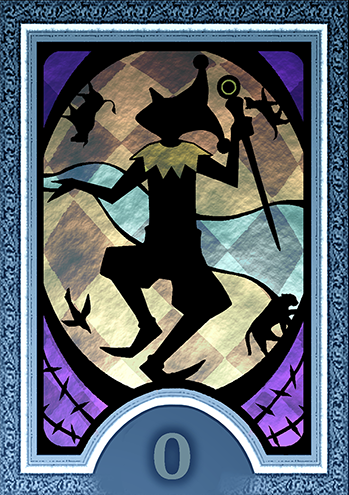
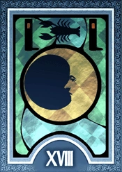

# ABOUT ME

> **SHIA // UNISA STUDENT**  
> *"Benvenuto sul mio canale personale, **The Shia Channel**! Questa pagina è uno showcase delle mie passioni più che dei miei progetti, ma nonostante ciò spero possa graderti. Già che ci sei, se stai leggendo questo messaggio puoi contattarmi tramite i miei **Social Link** ;)"*

Ciao! Mi chiamo **Cristian** (alias online **Shia**) e ho 21 anni. Sono uno studente di Informatica presso l'Università degli Studi di Salerno, e se non si fosse notato, un grande fan di **Persona 4**, il mio gioco Atlus preferito. Ma dunque all'infuori di questo, chi sono davvero? Qual è il **vero io**? <!--Enter sezione dedicata allo spiegare Persona 4 e il pensiero filosofico, in breve.--> 

  <a href="#social-links" class="p4-btn">▶ SOCIAL LINKS</a>
  <a href="#progetti" class="p4-btn">📺 BROADCASTS </a>
  <a href="#percorso" class="p4-btn">📜 QUEST LOG</a>
  <a href="#status" class="p4-btn">⚡STATS</a>

---

<h2 id="social-links">Social Links (S-Links)</h2>

> **??? // THE TRUE SELF**  
> *"Thou art I... And I am thou... Thou hast established a new **bond**... It brings thee closer to **the truth**..."*

  <!-- GitHub -->
  <a href="https://github.com/cristian-carotenuto" class="slink-card" target="_blank" rel="noopener">
  

    
  

  

    GitHub
    ARCANA: THE FOOL // CODING
  

</a>

  <!-- LinkedIn -->
  <a href="https://www.linkedin.com/in/cristian-carotenuto-11a57933b" class="slink-card" target="_blank" rel="noopener">
  

    
  

  

    LinkedIn
    ARCANA: THE SUN // CAREER
  

</a>

  <!-- Email -->
  <a href="mailto:ccristian.carotenuto@gmail.com" class="slink-card" target="_blank" rel="noopener">
  

    
  

  

    Email
    ARCANA: THE HIEROPHANT // DIRECT MSG
  

</a>

  <!-- Steam -->
  <a href="https://steamcommunity.com/id/quel_player_random/" class="slink-card" target="_blank" rel="noopener">
  

    
  

  

    Steam
    ARCANA: THE MAGICIAN // GAMING
  

</a>

  <!-- Discord -->
  <a href="https://discordapp.com/users/263351865566035970" class="slink-card" target="_blank" rel="noopener">
  

    
  

  

    Discord
    ARCANA: THE JESTER // COMMUNITY
  

</a>

<!-- Twitch -->
  <a href="https://www.twitch.tv/shia_twitch" class="slink-card" target="_blank" rel="noopener">
  

    
  

  

    Twitch
    ARCANA: THE MOON // STREAMING
  

</a>

---

<h2 id="progetti">Progetti // Midnight Broadcasts</h2>

> **MYSTERIOUS TV BROADCAST // THE URBAN LEGEND**  
> *"You're supposed to look into a TV that's switched off, alone, exactly at **midnight** on a **rainy night**. While you're staring at your own image, another person will appear on the screen... And they say that person's your **soulmate**."*

  <!-- TV Project Card 1 -->
  

    

      SVAGO
      ● ON AIR
    

    

      <h3 class="tv-card-title">Persona 4 GitHub Page Theme</h3>
      

        Personalizzazione completa e dinamica di GitHub Page in stile Persona 4. No ma è letteralmente questa pagina che stai vedendo adesso, è un self-insert doveroso dai... **Tecnologie usate : SCSS, HTML.**  
      

    

    

      <a href="https://github.com/cristian-carotenuto/cristian-carotenuto.github.io" class="p4-btn" target="_blank" rel="noopener" style="font-size: 1.1rem; padding: 4px 16px !important;">
        Repository ▶
      </a>
    

  

  <!-- TV Project Card 2 -->
  

    

      UNIVERSITY
      ● ON AIR
    

    

      <h3 class="tv-card-title">MAP4AID</h3>
      

        Map4Aid è una piattaforma web dedicata alla solidarietà e all'assistenza sociale che mira a digitalizzare e semplificare l'accesso ai beni di prima necessità e a facilitare le donazioni sul territorio. **Tecnologie usate: Python, Flask, SQLite, HTML, CSS, JS.**
      

    

    

      <a href="https://github.com/cristian-carotenuto/map4aid" class="p4-btn p4-btn" target="_blank" rel="noopener" style="font-size: 1.1rem; padding: 4px 16px !important;">
        Repository ▶
      </a>
    

  

  <!-- TV Project Card 3 -->
  

    

      UNIVERSITY
      ● ON AIR
    

    

      <h3 class="tv-card-title">AIDANO</h3>
      

        Aidano è un assistente virtuale knowledge-based sviluppato nell'ambito del progetto Map4Aid. Il chatbot è stato progettato per assistere gli utenti della piattaforma fornendo risposte rapide, coerenti e contestualizzate riguardo ai servizi offerti. **Tecnologie usate: Python, QWEN 2.5-3B.**
      

    

    

      <a href="https://github.com/cristian-carotenuto/Aidano" class="p4-btn p4-btn" target="_blank" rel="noopener" style="font-size: 1.1rem; padding: 4px 16px !important;">
        Repository ▶
      </a>
    

  

  
    <!-- TV Project Card 4 -->
  

    

      VOLUNTEERING
      ● ON AIR
    

    

      <h3 class="tv-card-title">RETE CIVES CAMPANIA</h3>
      

      Ho contribuito allo sviluppo della piattaforma della rete CIVES grazie al presidente **Giuseppe Fornaro**. La CIVES è una rete di associazioni del Terzo Settore attiva in Campania per promuovere inclusione sociale, autonomia personale e accessibilità per persone con disabilità, in particolare non vedenti, ipovedenti e le loro famiglie. **Tecnologie usate: WordPress, PHP, SQL.**
      

    

    

      <a href="https://www.retecives.it/" class="p4-btn p4-btn" target="_blank" rel="noopener" style="font-size: 1.1rem; padding: 4px 16px !important;">
        Website ▶
      </a>
    

  

<!-- TV Project Card 5 -->
  

    

      ???
      ● STANDBY
    

    

      <h3 class="tv-card-title">WORK IN PROGRESS</h3>
      

        *Spazio dedicato a progetti futuri*
      

    

    

      <a href="https://github.com/cristian-carotenuto" class="p4-btn p4-btn-dark" target="_blank" rel="noopener" style="font-size: 1.1rem; padding: 4px 16px !important;">
        Github ▶
      </a>
    

  

<!-- TV Project Card 6 -->
  

    

      ???
      ● STANDBY
    

    

      <h3 class="tv-card-title">WORK IN PROGRESS</h3>
      

        *Spazio dedicato a progetti futuri*
      

    

    

      <a href="https://github.com/cristian-carotenuto" class="p4-btn p4-btn-dark" target="_blank" rel="noopener" style="font-size: 1.1rem; padding: 4px 16px !important;">
        Github ▶
      </a>
    

  

---

<h2 id="percorso">Il Mio Percorso // Quest Log</h2>

> **??? // VELVET ROOM HOST**  
> *"Welcome to the **Velvet Room**... I am delighted to make your acquaintance. This place exists between dream and reality, mind and matter... It is a room that only those who are bound by a **"contract"** may enter... It may be that such a fate awaits you in the near future. Now then... Why don't you introduce yourself...?"*

<!-- Interactive Filter Bar -->

  <button type="button" class="percorso-filter-btn is-active" data-filter="all">ALL QUESTS</button>
  <button type="button" class="percorso-filter-btn" data-filter="work">LAVORO & TECH</button>
  <button type="button" class="percorso-filter-btn" data-filter="edu">FORMAZIONE & STUDI</button>
  <button type="button" class="percorso-filter-btn" data-filter="vol">VOLONTARIATO & SOCIALE</button>
  <a href="{{ '/assets/images/CV Cristian Carotenuto 2026-10-01.pdf' | relative_url }}" class="percorso-cv-dl-btn" target="_blank" rel="noopener" title="Visualizza e scarica il CV completo in PDF">
    CV (PDF) 📄
  </a>

<!-- Interactive Timeline Cards -->

  <!-- Quest 1: Università degli Studi di Salerno -->
  

    

      2023 — 2027
      ● ACTIVE QUEST // BACHELOR'S
    

    <h3 class="percorso-card-title">Laurea Triennale in Informatica (L-31)</h3>
    
Università degli Studi di Salerno &bull; Fisciano (SA) &bull; Media Esami: 24.7

    

      <ul>
        <li><strong>Materie di rilievo:</strong> Fondamenti d'Intelligenza Artificiale, Ingegneria del Software, Basi di Dati, Progettazione Algoritmi, Architettura dei Sistemi.</li>
        <li><strong>Progetti Accademici:</strong>
          <ul>
            <li>Ciclo di vita del software e testing collaborativo condotto tramite metodologia agile <strong>SCRUM</strong>.</li>
            <li>Training e deployment di un <strong>Agente Conversazionale AI</strong> nel ruolo di Customer Service virtuale (modulo di IA).</li>
            <li>Progettazione architetturale e design frontend di una piattaforma mock per e-commerce.</li>
          </ul>
        </li>
      </ul>
    

    

      AI & Chatbots
      Ingegneria del Software
      SCRUM Agile
      SQL & Database
      Java / C / Python
    

  

  <!-- Quest 2: Piattaforma Rete Cives -->
  

    

      2026 — IN CORSO
      ● ACTIVE QUEST // ACCESSIBILITY
    

    <h3 class="percorso-card-title">Web Developer & Specialista Accessibilità</h3>
    
Rete Cives Campania &bull; www.retecives.it

    

      <ul>
        <li>Progettazione, sviluppo ed implementazione della piattaforma online secondo i rigorosi standard di <strong>accessibilità web (WCAG)</strong> per persone non vedenti e ipovedenti.</li>
        <li>Implementazione di architettura per <strong>disaster recovery speculare</strong> e massimizzazione del grado di resilienza dei dati.</li>
        <li>Selezione, installazione e configurazione di plugin strategici per sicurezza, caching e performance del portale.</li>
      </ul>
    

    

      WordPress
      PHP
      SQL
      Web Accessibility (WCAG)
      Disaster Recovery
    

  

  <!-- Quest 3: Volontario SCU -->
  

    

      2025 — 2026
      ✔ QUEST CLEARED // VOLUNTEERING
    

    <h3 class="percorso-card-title">Volontario SCU (Servizio Civile Universale)</h3>
    
Rete Cives Campania &bull; Sant'Anastasia (NA)

    

      <ul>
        <li>Assistenza sul campo e accompagnamento dedicato per persone <strong>non vedenti e ipovedenti</strong> su tutto il territorio campano.</li>
        <li>Gestione dello <strong>sportello digitale</strong> e supporto al pubblico per pratiche CAF e servizi telematici.</li>
        <li>Utilizzo del software gestionale <strong>Zucchetti</strong> e della suite Microsoft Office per la digitalizzazione amministrativa.</li>
      </ul>
    

    

      Inclusione Sociale
      Sportello Digitale
      Software Zucchetti
      Assistenza Utenti
    

  

  <!-- Quest 4: Sport Village -->
  

    

      2022 — 2023
      ✔ QUEST CLEARED // PART TIME
    

    <h3 class="percorso-card-title">Segreteria Operativa & Help Desk</h3>
    
Sport Village &bull; Somma Vesuviana (NA)

    

      <ul>
        <li>Supporto informatico di primo livello e risoluzione ticket hardware/software, sia in presenza che da remoto.</li>
        <li>Interfaccia con oltre <strong>40 clienti al giorno</strong>, garantendo precisione, accoglienza e flusso continuo allo sportello.</li>
        <li>Gestione multicanale di prenotazioni (telefonico, email e piattaforma gestionale interna).</li>
        <li>Elaborazione e organizzazione di report amministrativi tramite Microsoft Excel.</li>
      </ul>
    

    

      IT Support & Ticketing
      Front Desk
      Excel Amministrativo
      Problem Solving
    

  

  <!-- Quest 5: Diagnostica Hardware & Riparazione PC -->
  

    

      2022+ .
      ★ PASSIVE SKILL // HARDWARE EXPERT
    

    <h3 class="percorso-card-title">Diagnostica, Assemblaggio & Riparazione PC</h3>
    
Attività Tecnica sul Campo &bull; Per passaparola

    

      <ul>
        <li>Oltre 3 anni di esperienza diretta nella <strong>diagnostica hardware avanzata</strong>, troubleshooting di problemi di performance, boot e stabilità.</li>
        <li>Riparazione e sostituzione componenti per computer desktop e workstation portatili.</li>
        <li>Assemblaggio di build personalizzate da gaming e lavoro, cablaggio pulito (cable management) e ottimizzazione.</li>
      </ul>
    

    

      Hardware Troubleshooting
      PC Building
      Diagnostica
      BIOS & OS Setup
    

  

  <!-- Quest 6: ITIS E. Majorana -->
  

    

      2018 — 2023
      ✔ QUEST CLEARED // VOTO: 94/100
    

    <h3 class="percorso-card-title">Diploma in Telecomunicazioni e Informatica</h3>
    
ITIS E. Majorana &bull; Somma Vesuviana (NA)

    

      <ul>
        <li>Percorso quinquennale incentrato su fondamenti di programmazione, sistemi e reti, protocolli di comunicazione e telecomunicazioni.</li>
        <li>Partecipante al progetto internazionale <strong>Erasmus+ in Romania</strong> (<em>"Under the Same Sky 2023"</em>).</li>
      </ul>
    

    

      Telecomunicazioni
      Sistemi e Reti
      C / C++
      Java
      Erasmus+
    

  

---

<h2 id="status">Social Stats & Skills</h2>

> **??? // MYSTERIOUS VOICE**  
> *"Thy present glow comes from one of the splendid **virtues** already dwelling within thee..."*

  
  

    CORAGGIO (Backend & Frontend)
    

      

    

    RANK 4 (Daring)
  

  

    DILIGENZA (Resilienza & Precisione)
    

      

    

    RANK MAX (Rock Solid)
  

  

    CONOSCENZA (Tecnologie & Problem Solving)
    

      

    

    RANK 4 (Expert)
  

  

    ESPRESSIONE (Comunicazione & UI / UX Design)
    

      

    

    RANK 4 (Touching)
  

  

    COMPRENSIONE (Empatia & Lavoro di Squadra)
    

      

    

    RANK MAX (Saint)
  

